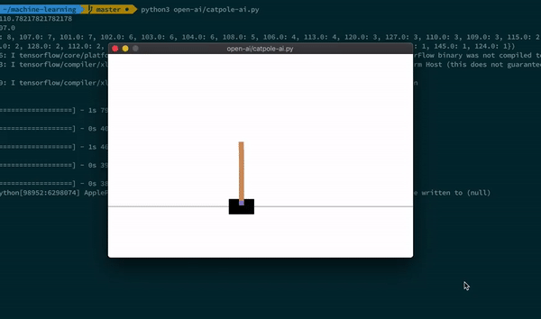

# Experiments on machine learning and data science

Dataset sources:
1. Kaggle
2. MNIST
3. OpenAI

Some examples of Machine learning experiments in this repo include:

1. Linear regression
2. K-Nearest Neighbors
3. K-Means
4. Support Vector Machines
5. Deep Neural networks

Source code location: [open-ai/catpole-ai.py](https://github.com/manavdahra/machine-learning/blob/master/open-ai/catpole-ai.py)

